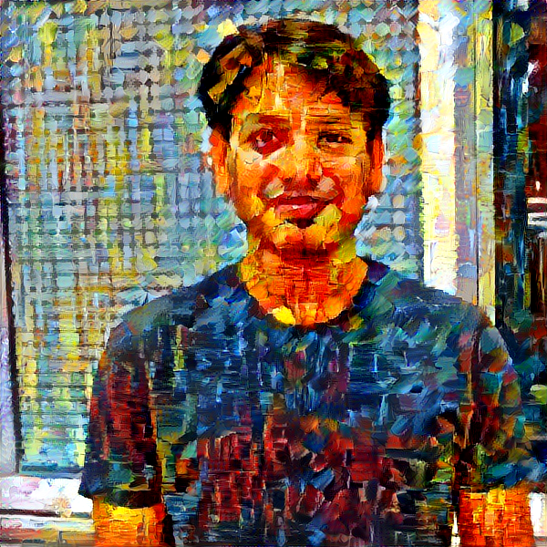

# keras_style_transfer
Keras Based Implementation of Style Transfer Algorithm

Keras Style Transfer is originated from Keras <https://keras.io> example implementation of neural style transfer to create "deep" and impressive image (The original paper "A Neural Algorithm of Artistic Style" can be found at <https://arxiv.org/abs/1508.06576>)


## n_style.py

> The script has been updated to work with latest Keras 2.2.0

The python script is `n_style.py` is the Keras implementation of the neural style transfer algorithm, using a pre-trained convolutional neural network (VGG19).

The `run.sh` bash script takes your input {content_image}, {style_image} and {output_directory} for generating the results.

```bash
sh run.sh input_image style_image output_directory
```

For each epoch, an iteration image will be saved in the `output_directory` directory with an image `result_image_at_iteration_{N}.png` file (where {N} is the iteration number). This is interesting to trace through how the neural network perceived and built the image.

For reader's convenience, the script input parameters are repeated here:

* *--image_size* : Allows to set the Gram Matrix size. Default is 400 (width), since it produces good results fast.
* *--iter* : Number of iterations. Default is 10. Test the output with 10 iterations, and increase to improve results.
* *--content_weight*: The weight given to the content loss (Default is 0.025)
* *--style_weight*: The weight given to the style loss (Default is 1.0)
* *--tv_weight* : Regularization factor. Smaller values tend to produce crisp images, but 0 is not useful. Default = 1E-5
* *--content_layer* : Selects the content layer. Paper suggests block4_conv2, but better results can be obtained from block5_conv2. Default is block5_conv2.
* *--min_improvement* : Defines minimum improvement required to continue script. Default is 0.0

To replicate the results in the video, try to use the following input parameters
(tested on K80 GCP)

```
...
python n_style.py "$1" "$2" "$3/$3" \
  --image_size 600 \
  --content_weight 1E-05 \
  --style_weight 1.0 \
  --tv_weight 8.5E-05 \
  --iter 300 \
  --content_layer "block5_conv1" \
  --min_improvement 0
```
## Some Samples
